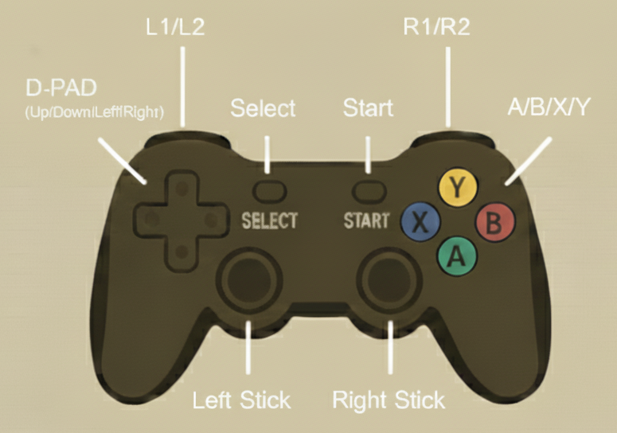

<!-- LOGO -->
<p align="center">
  <a href="https://botbot.bot" target="_blank">
    
  </a>
</p>

# joystick bot - Interface de Joystick para ROS2

[🇺🇸 English Version](README.md)

Um pacote ROS2 flexível e configurável para interfacear controles de jogos/joysticks com robôs. Este pacote utiliza pygame para ler entradas de joystick e publicá-las como tópicos ROS2, facilitando o controle do seu robô com qualquer controle de jogo padrão.

## Funcionalidades

- **Arquitetura de Nó Lifecycle**: Gerenciamento adequado de estados com nós lifecycle do ROS2
- **Suporte a Hot-plug**: Detecta automaticamente conexão e desconexão do joystick
- **Totalmente Configurável**: Mapeamentos de botões e eixos podem ser personalizados via configuração YAML
- **Nomes de Tópicos Personalizáveis**: Publique em qualquer nome de tópico que você preferir
- **Botão de Segurança (Dead Man Switch)**: Recurso de segurança para controle do robô
- **Suporte a Zona Morta (Deadband)**: Zonas mortas configuráveis para analógicos para prevenir drift
- **Suporte Padrão ao DualSense (PS5)**: Pré-configurado para controle DualSense do PlayStation 5

### Vídeo Demonstrativo

[▶️ Assista ao vídeo demonstrativo](https://www.youtube.com/watch?v=TQeibdXH21g)

*Vídeo demonstrativo mostrando o lançamento do nó, configuração do lifecycle e publicação de tópicos em ação.*

## Índice

- [Instalação](#instalação)
- [Início Rápido](#início-rápido)
- [Configuração](#configuração)
- [Tópicos Publicados](#tópicos-publicados)
- [Parâmetros](#parâmetros)
- [Controles Suportados](#controles-suportados)
- [Solução de Problemas](#solução-de-problemas)
- [Gerenciamento de Lifecycle](#gerenciamento-de-lifecycle)
- [Estrutura de Diretórios](#estrutura-de-diretórios)
- [Tipos de Mensagens Customizadas](#tipos-de-mensagens-customizadas)
- [Dependências](#dependências)
- [Contribuindo](#contribuindo)
- [Licença](#licença)

## Instalação

### Pré-requisitos

- ROS2 (Humble ou posterior)
- Python 3
- pygame

### Instalar pygame

```bash
pip3 install pygame
```

### Compilar o Pacote

```bash
cd ~/seu_workspace_ros2
colcon build --packages-select joystick_bot
source install/setup.bash
```

## Início Rápido

### Iniciar o Nó

```bash
ros2 launch joystick_bot js.launch.py
```

### Configurar e Ativar o Nó Lifecycle

O nó inicia no estado `unconfigured` (não configurado). Para usá-lo, você precisa configurar e ativá-lo:

```bash
# Configurar o nó
ros2 lifecycle set /joystick_interface configure

# Ativar o nó
ros2 lifecycle set /joystick_interface activate
```

### Verificar Tópicos Publicados

```bash
# Visualizar comandos de velocidade
ros2 topic echo /cmd_vel_joy

# Visualizar estados dos botões
ros2 topic echo /button_state

# Visualizar estado do botão de segurança
ros2 topic echo /dead_man_switch
```

## Configuração

O arquivo de configuração principal está localizado em `config/js_config.yaml`. Você pode personalizar todos os aspectos da interface do joystick.

### Configuração Padrão

O pacote vem pré-configurado com valores padrão adequados para o **controle DualSense do PlayStation 5**. Se você estiver usando um controle DualSense, pode usar o pacote sem nenhuma alteração de configuração.

### Exemplo de Configuração

```yaml
/**/joystick_interface:
  ros__parameters:
    device_input: "/dev/input/js0"
    linear_deadband: 0.02
    angular_deadband: 0.02

    # Nomes dos tópicos
    cmd_vel_topic: "cmd_vel_joy"
    button_state_topic: "button_state"
    dead_man_switch_topic: "dead_man_switch"

    # Mapeamentos de botões (índices de botões do pygame)
    # Valores padrão configurados para controle DualSense (PS5)
    button_mapping:
      x_button: 0
      a_button: 1
      b_button: 2
      y_button: 3
      l1_button: 4
      r1_button: 5
      l2_button: 6
      r2_button: 7
      select_button: 8
      start_button: 9
      dead_man_button: 4  # Botão L1 por padrão

    # Mapeamentos de eixos (índices de eixos do pygame)
    # Valores padrão configurados para controle DualSense (PS5)
    axis_mapping:
      linear_x_axis: 1    # Analógico esquerdo vertical
      linear_y_axis: 0    # Analógico esquerdo horizontal
      angular_y_axis: 5   # Analógico direito vertical
      angular_z_axis: 2   # Analógico direito horizontal
```

### Arquivo de Configuração Personalizado

Você pode especificar um arquivo de configuração personalizado ao iniciar:

```bash
ros2 launch joystick_bot js.launch.py config_file:=/caminho/para/seu/config.yaml
```

## Tópicos Publicados

| Tópico | Tipo | Descrição |
|--------|------|-----------|
| `/cmd_vel_joy` (padrão) | `geometry_msgs/Twist` | Comandos de velocidade dos eixos do joystick |
| `/button_state` (padrão) | `joystick_bot/ControllerButtonsState` | Estado atual de todos os botões do controle |
| `/dead_man_switch` (padrão) | `std_msgs/Bool` | Estado do botão de segurança (botão L1 por padrão) |

## Parâmetros

### Parâmetros Gerais

| Parâmetro | Tipo | Padrão | Descrição |
|-----------|------|--------|-----------|
| `device_input` | string | `/dev/input/js0` | Caminho do dispositivo para o joystick |
| `linear_deadband` | double | 0.02 | Limite de zona morta para eixos lineares |
| `angular_deadband` | double | 0.02 | Limite de zona morta para eixos angulares |

### Parâmetros de Nomes de Tópicos

| Parâmetro | Tipo | Padrão | Descrição |
|-----------|------|--------|-----------|
| `cmd_vel_topic` | string | `cmd_vel_joy` | Nome do tópico para comandos de velocidade |
| `button_state_topic` | string | `button_state` | Nome do tópico para estados dos botões |
| `dead_man_switch_topic` | string | `dead_man_switch` | Nome do tópico para botão de segurança |

### Parâmetros de Mapeamento de Botões

Todos os mapeamentos de botões são índices de botões do pygame (inteiros). **Valores padrão são para controle DualSense (PS5):**

| Parâmetro | Padrão | Descrição |
|-----------|--------|-----------|
| `button_mapping.x_button` | 0 | Botão X/Quadrado |
| `button_mapping.a_button` | 1 | Botão A/Cruz |
| `button_mapping.b_button` | 2 | Botão B/Círculo |
| `button_mapping.y_button` | 3 | Botão Y/Triângulo |
| `button_mapping.l1_button` | 4 | L1/Gatilho esquerdo superior |
| `button_mapping.r1_button` | 5 | R1/Gatilho direito superior |
| `button_mapping.l2_button` | 6 | L2/Gatilho esquerdo |
| `button_mapping.r2_button` | 7 | R2/Gatilho direito |
| `button_mapping.select_button` | 8 | Botão Select/Share |
| `button_mapping.start_button` | 9 | Botão Start/Options |
| `button_mapping.dead_man_button` | 4 | Botão de segurança (L1) |

### Parâmetros de Mapeamento de Eixos

Todos os mapeamentos de eixos são índices de eixos do pygame (inteiros). **Valores padrão são para controle DualSense (PS5):**

| Parâmetro | Padrão | Descrição |
|-----------|--------|-----------|
| `axis_mapping.linear_x_axis` | 1 | Analógico esquerdo vertical (frente/trás) |
| `axis_mapping.linear_y_axis` | 0 | Analógico esquerdo horizontal (esquerda/direita) |
| `axis_mapping.angular_y_axis` | 5 | Analógico direito vertical (pitch) |
| `axis_mapping.angular_z_axis` | 2 | Analógico direito horizontal (yaw/rotação) |

## Controles Suportados

#### Referência de Botões do Controle

O diagrama a seguir ilustra as convenções padrão de nomenclatura e posicionamento de botões utilizadas neste pacote. Use isso como referência ao configurar seu próprio controle:



Se o seu controle possui um layout diferente, você pode personalizar os mapeamentos de botões e eixos através do arquivo js_config.yaml.

### Controle DualSense do PlayStation 5 (Padrão)

A configuração padrão é otimizada para o **controle DualSense (PS5)**. Simplesmente conecte seu controle via USB ou Bluetooth e inicie o nó.

#### Mapeamento de Controles do DualSense (Padrão):

| Controle | Função | Parâmetro | Índice |
|----------|--------|-----------|--------|
| **Analógico Esquerdo** | Movimento do robô (frente/trás, esquerda/direita) | `linear_x_axis`, `linear_y_axis` | Eixos 1, 0 |
| **Analógico Direito** | Rotação do robô (yaw/pitch) | `angular_z_axis`, `angular_y_axis` | Eixos 2, 5 |
| **Cruz (X)** | Botão A | `a_button` | Botão 1 |
| **Círculo (O)** | Botão B | `b_button` | Botão 2 |
| **Quadrado** | Botão X | `x_button` | Botão 0 |
| **Triângulo** | Botão Y | `y_button` | Botão 3 |
| **L1** | Botão de segurança / Botão L1 | `dead_man_button`, `l1_button` | Botão 4 |
| **R1** | Botão R1 | `r1_button` | Botão 5 |
| **L2** | Gatilho L2 | `l2_button` | Botão 6 |
| **R2** | Gatilho R2 | `r2_button` | Botão 7 |
| **Share** | Botão Select | `select_button` | Botão 8 |
| **Options** | Botão Start | `start_button` | Botão 9 |
| **D-pad** | Botões direcionais | HAT 0 | Valores HAT |


### Outros Controles

Para usar outros controles (Xbox, Logitech, etc.), você precisará determinar os mapeamentos de botões e eixos para seu controle específico.

#### Encontrando Mapeamentos de Botões e Eixos

A maneira mais fácil de encontrar mapeamentos de botões e eixos é usando a ferramenta de linha de comando `jstest`:

```bash
# Instalar jstest se ainda não estiver disponível
sudo apt-get install joystick

# Monitorar eventos do joystick em tempo real
jstest /dev/input/js0
```

Pressione botões e mova os analógicos para ver quais índices de botão/eixo são acionados. A saída mostrará:
- Números de botões quando pressionados/soltos
- Números de eixos e seus valores quando os analógicos são movidos

Uma vez identificados os índices para seu controle, atualize o arquivo `config/js_config.yaml` com seus mapeamentos personalizados.

## Solução de Problemas

### Joystick Não Detectado

1. Verifique se o joystick é reconhecido pelo sistema:
   ```bash
   ls /dev/input/js*
   ```

2. Verifique se o pygame pode detectá-lo:
   ```bash
   python3 -c "import pygame; pygame.init(); pygame.joystick.init(); print(f'Joysticks encontrados: {pygame.joystick.get_count()}')"
   ```

3. Verifique as permissões:
   ```bash
   sudo chmod a+rw /dev/input/js0
   ```

### Problemas de Conexão

- Se estiver usando Bluetooth, certifique-se de que o controle está pareado corretamente
- Tente reconectar o controle (USB ou Bluetooth)
- Verifique `dmesg` para erros de dispositivo USB/input
- O nó suporta hot-plugging, então você pode desconectar e reconectar enquanto está executando

### Drift ou Movimento Indesejado

- Aumente os valores de zona morta na configuração:
  ```yaml
  linear_deadband: 0.05
  angular_deadband: 0.05
  ```

### Mapeamentos de Botões Incorretos

- Use os scripts de descoberta de botões/eixos acima para encontrar os índices corretos
- Atualize `config/js_config.yaml` com os mapeamentos do seu controle

## Gerenciamento de Lifecycle

Este nó usa gerenciamento lifecycle do ROS2 com os seguintes estados:

- **Unconfigured** (Não Configurado): Estado inicial, nenhum recurso alocado
- **Inactive** (Inativo): Configurado mas não publicando (estado seguro)
- **Active** (Ativo): Totalmente operacional, lendo joystick e publicando dados
- **Finalized** (Finalizado): Limpo e desligado

### Comandos Lifecycle

```bash
# Configurar o nó
ros2 lifecycle set /joystick_interface configure

# Ativar o nó
ros2 lifecycle set /joystick_interface activate

# Desativar (mantém configuração)
ros2 lifecycle set /joystick_interface deactivate

# Limpeza (retorna para não configurado)
ros2 lifecycle set /joystick_interface cleanup

# Desligar
ros2 lifecycle set /joystick_interface shutdown
```

## Estrutura de Diretórios

```
joystick_bot/
├── joystick_bot/                  # Diretório do pacote Python
│   └── __init__.py               # Inicialização do pacote
├── config/                        # Arquivos de configuração
│   └── js_config.yaml            # Parâmetros de configuração do joystick
├── docs/                          # Arquivos de documentação
│   └── images/                   # Imagens e mídia
│       ├── controller_layout.png # Diagrama de referência dos botões do controle
│       └── running_example.mp4   # Vídeo demonstrativo
├── launch/                        # Arquivos de launch
│   └── js.launch.py              # Lançador da interface do joystick
├── msg/                          # Definições de mensagens customizadas
│   └── ControllerButtonsState.msg # Mensagem de estado dos botões
├── scripts/                       # Scripts executáveis
│   └── js_node.py                # Nó principal da interface do joystick
├── CMakeLists.txt                # Configuração de build do CMake
├── package.xml                   # Manifesto do pacote ROS2
├── README.md                     # Documentação em inglês
└── README_br.md                  # Este arquivo (versão em português)
```

## Tipos de Mensagens Customizadas

### ControllerButtonsState

```
bool a_button
bool b_button
bool x_button
bool y_button
bool start_button
bool select_button
bool up_button      # D-pad
bool down_button    # D-pad
bool left_button    # D-pad
bool right_button   # D-pad
bool l1_button
bool l2_button
bool r1_button
bool r2_button
```

## Dependências

### Pacotes ROS2
- `rclpy` - Biblioteca cliente Python para ROS2
- `rclcpp` - Biblioteca cliente C++ para ROS2
- `std_msgs` - Tipos de mensagens padrão
- `geometry_msgs` - Tipos de mensagens de geometria
- `rosidl_default_generators` - Geração de interfaces

### Dependências Externas
- `pygame` - Biblioteca de manipulação de entrada de joystick
- Subsistema de entrada do Linux (`/dev/input/js*`)

## Contribuindo

Contribuições são bem-vindas! Sinta-se à vontade para enviar issues ou pull requests.

### Fluxo de Desenvolvimento

1. Faça fork do repositório
2. Crie uma branch de funcionalidade
3. Faça suas alterações
4. Teste minuciosamente
5. Envie um pull request

## Licença

Este projeto está licenciado sob a Licença MIT - veja o arquivo [LICENSE](LICENSE) para detalhes.


<p align="center">Criado com ❤️ no Brasil</p>

<p align="right">
  
</p>

