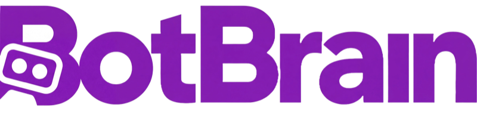
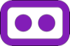
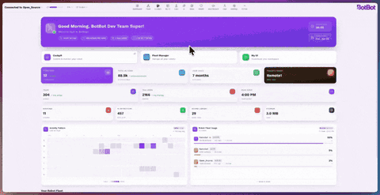
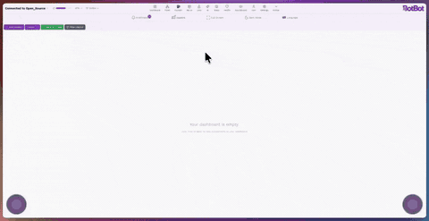
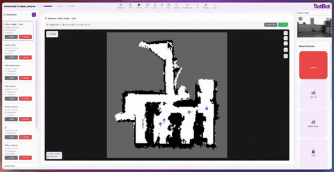
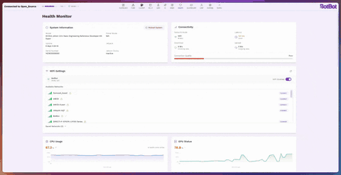
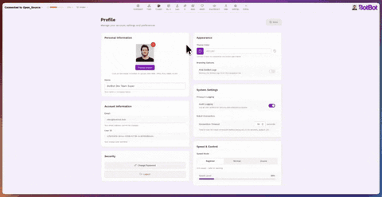
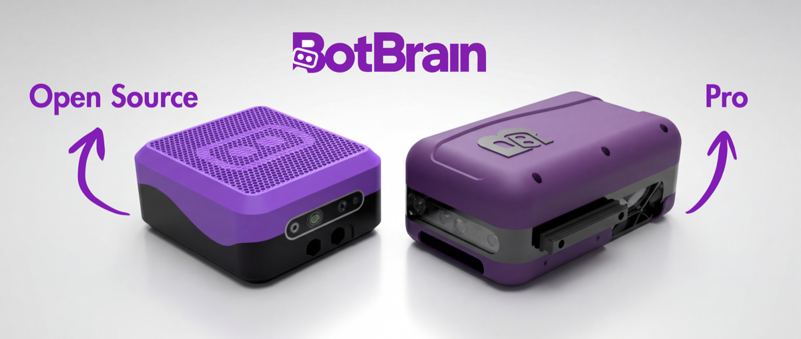
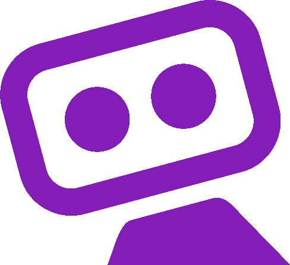

<!-- LOGO -->
<p align="center">
  <a href="https://botbot.bot" target="_blank">
    
  </a>
</p>

<p align="center">
  Un Cerveau, n'importe quel Robot.
</p>

<p align="center">
  
  
  
  
</p>

<p align="center">
  <a href="https://botbot.bot"></a>
  <a href="https://discord.gg/CrTbJzxXes"></a>
  <a href="https://www.linkedin.com/company/botbotrobotics"></a>
  <a href="https://www.youtube.com/@botbotrobotics"></a>
</p>

<p align="center">
  <a href="../../README.md"></a>
  <a href="README_pt.md"></a>
  <a href="README_fr.md"></a>
  <a href="README_zh-CN.md"></a>
  <a href="README_es.md"></a>
</p>

> **Note :** La version anglaise est la documentation officielle et la plus à jour. Cette traduction peut ne pas refléter les dernières modifications.

# BotBrain Open Source (BBOSS) 

BotBrain est une collection modulaire de composants logiciels et matériels open source qui vous permet de conduire, voir, cartographier, naviguer (manuellement ou de manière autonome), surveiller et gérer des robots à pattes (quadrupèdes, bipèdes et humanoïdes) ou à roues ROS2 depuis une interface web simple mais puissante. Le matériel fournit des supports imprimables en 3D et un boîtier externe pour que vous puissiez installer BotBrain sur votre robot sans complications.

- Conçu autour de l'Intel RealSense D435i et de la gamme NVIDIA Jetson
- Cartes officiellement supportées : Jetson Nano, Jetson Orin Nano (support AGX et Thor bientôt disponible)
- Tout est modulaire - vous n'avez pas besoin d'exécuter tous les modules (certains modules IA lourds nécessitent Orin AGX)

<h2 align="center">✨ Fonctionnalités en Aperçu</h2>

<table>
  <tr>
    <td align="center" width="50%">
      <br>
      <h3>Tableau de Bord et Contrôle de Flotte</h3>
      <p>Tableau de bord complet pour voir le statut, les informations du robot et accéder rapidement aux autres sections</p>
    </td>
    <td align="center" width="50%">
      <br>
      <h3>CockPit</h3>
      <p>Page de contrôle prédéfinie avec caméras avant/arrière complètes, modèle 3D, carte et navigation ainsi que des contrôles rapides</p>
    </td>
  </tr>
  <tr>
    <td align="center" width="50%">
      <br>
      <h3>Mon Interface</h3>
      <p>Interface de contrôle personnalisable avec toutes les fonctionnalités du cockpit</p>
    </td>
    <td align="center" width="50%">
      <br>
      <h3>Missions</h3>
      <p>Créez des missions pour que le robot les exécute et navigue de manière autonome</p>
    </td>
  </tr>
  <tr>
    <td align="center" width="50%">
      <br>
      <h3>Santé du Système</h3>
      <p>Visualisez la santé complète de BotBrain : utilisation CPU/GPU/RAM, contrôle et statut des nœuds de la machine d'état, contrôle de connexion WiFi</p>
    </td>
    <td align="center" width="50%">
      <br>
      <h3>Profil Utilisateur</h3>
      <p>Personnalisez l'apparence de BotBrain, définissez des couleurs personnalisées et des profils de vitesse</p>
    </td>
  </tr>
</table>

<p align="center">
  <br>
  <h3 align="center">Matériel Open Source</h3>
  <p>Rapide à imprimer en 3D, facile à assembler et conçu pour s'adapter à n'importe quel robot.
  Faites fonctionner votre robot avec BotBrain en moins de 30 minutes.</p>
</p>

<p align="center">
  <a href="https://youtu.be/VBv4Y7lat8Y">📹 Regardez BotBrain effectuer 1 heure de patrouilles autonomes dans notre bureau</a>
</p>


## Liste Complète des Fonctionnalités

### Support Multi-Robot

- **Unitree Go2 & Go2-W** - Robots quadrupèdes avec interface matérielle et contrôle complets
- **Unitree G1** - Humanoïde avec contrôle de posture du haut du corps et transitions FSM
- **DirectDrive Tita** - Bipède avec contrôle complet
- **Robots personnalisés** - Framework extensible pour ajouter n'importe quelle plateforme compatible ROS2
- **À pattes et à roues** - L'architecture supporte les deux types de locomotion

### Matériel et Capteurs

- **Boîtier imprimable en 3D** - Design à encliquetage avec adaptateurs de montage spécifiques aux robots (Go2, G1 et Direct drive Tita)
- **Intel RealSense D435i** - Support double caméra pour la visualisation et SLAM/Navigation
- **IMU et odométrie** - Estimation de pose en temps réel de toutes les plateformes supportées
- **Surveillance de batterie** - État de batterie par robot avec estimation d'autonomie

### IA et Perception

- **Détection d'objets YOLOv8/v11** - Plus de 80 classes, optimisé TensorRT, suivi en temps réel sur BotBrain
- **Moondream AI** - Compréhension visuelle multimodale et analyse de scène
- **Contrôle par langage naturel ROSA** - Commandes conversationnelles pour robot via LLM
- **Historique des détections** - Journal consultable avec image et information/description

### Navigation Autonome

- **RTABMap SLAM** - Cartographie visuelle avec une ou deux caméras RealSense D435i
- **Intégration Nav2** - Planification de trajectoire, évitement d'obstacles dynamiques, comportements de récupération
- **Planification de missions** - Créez et exécutez des patrouilles autonomes multi-waypoints
- **Navigation par clic** - Définissez des destinations directement sur l'interface de carte
- **Gestion des cartes** - Sauvegardez, chargez, changez et définissez des positions de départ

### Orchestration du Système

- **Gestion du cycle de vie** - Démarrage/arrêt coordonné des nœuds avec ordonnancement des dépendances
- **Machine d'état** - États système avec marche/arrêt automatique
- **Contrôle de vitesse par priorité** - Arbitrage de commandes à 6 niveaux (joystick > nav > IA)
- **Interrupteur de sécurité** - Verrouillage de sécurité matériel/logiciel pour toutes les commandes de mouvement
- **Arrêt d'urgence** - Séquence d'e-stop complète

### Interfaces de Contrôle

- **CockPit** - Page de contrôle préconfigurée avec caméras, modèle 3D, carte et actions rapides
- **Mon Interface** - Tableau de bord personnalisable avec glisser-déposer et widgets redimensionnables
- **Joysticks virtuels** - Contrôle double stick tactile/souris avec réglage de vitesse
- **Support gamepad** - PS5, Xbox ou joystick générique avec mappage de boutons personnalisé et changement de mode
- **Contrôle clavier** - Contrôles WASD
- **Profils de vitesse** - Plusieurs préréglages de vitesse pour différents modes opérationnels (Débutant, Normal et mode Extrême)
- **Actions du robot** - Debout/assis, verrouiller/déverrouiller, sélection de démarche, lumières, transitions de mode

### Caméra et Vidéo

- **Streaming multi-caméra** - Découverte dynamique pour les topics de caméra avant, arrière et personnalisés
- **Codecs H.264/H.265** - Mise à l'échelle de résolution, contrôle du taux de trames, optimisation de bande passante
- **Enregistrement dans le navigateur** - Enregistrez la vidéo des caméras et sauvegardez dans votre dossier de téléchargements
- **Visualisation 3D** - Modèle robot basé sur URDF avec superposition de scan laser et chemin de navigation

### Surveillance du Système

- **Statistiques Jetson** - Modèle de carte, version JetPack, mode d'alimentation, temps de fonctionnement
- **Surveillance CPU/GPU** - Utilisation par cœur, fréquence, mémoire, limitation thermique
- **Suivi de l'alimentation** - Tension, courant et puissance par rail avec détection de pic
- **Températures et ventilateurs** - Températures CPU/GPU/SOC avec contrôle de vitesse du ventilateur
- **Stockage et mémoire** - Alertes d'utilisation disque, surveillance RAM/swap

### Réseau et Flotte

- **Panneau de contrôle WiFi** - Scan de réseaux, changement et surveillance du signal
- **Modes de connexion** - WiFi, Ethernet, 4G, hotspot avec suivi de latence
- **Flotte multi-robot** - Connexions simultanées, commandes pour toute la flotte, tableau de bord de statut
- **Diagnostics** - Santé des nœuds, logs d'erreur/avertissement, visualisation de la machine d'état

### Personnalisation et UX

- **Thèmes clair/sombre** - Couleurs d'accentuation personnalisées, préférences persistantes
- **Mises en page responsives** - Mobile, tablette et bureau avec support tactile
- **Profils utilisateur** - Avatar, nom d'affichage, couleur du thème via Supabase Auth
- **Multi-langue** - Anglais et Portugais avec formats régionaux
- **Journal d'audit** - Historique d'événements consultable dans plus de 10 catégories avec export CSV
- **Analyse d'activité** - Cartes thermiques d'utilisation et suivi de l'utilisation du robot

## Table des Matières

- [Vue d'Ensemble](#vue-densemble)
- [Structure du Projet](#structure-du-projet)
- [Prérequis](#prérequis)
- [Installation](#installation)
  - [Configuration Matérielle](#1-configuration-matérielle)
  - [Configuration Supabase](#2-configuration-supabase)
  - [Configuration Logicielle](#3-configuration-logicielle)
- [Développement Frontend](#développement-frontend)
- [Fonctionnalités](#fonctionnalités)
- [Configuration](#configuration)
- [Robots Personnalisés](#ajouter-le-support-pour-dautres-robots--robots-personnalisés)
- [Dépannage](#dépannage)
- [Contribution](#contribution)
- [Licence](#licence--citation)

## Vue d'Ensemble

BotBrain se compose de trois composants principaux :

### Matériel
Un boîtier imprimable en 3D avec des supports internes conçus pour abriter une carte NVIDIA Jetson et deux caméras Intel RealSense D435i. La conception modulaire vous permet de connecter BotBrain à diverses plateformes robotiques sans fabrication personnalisée.

### Frontend
Un tableau de bord web Next.js 15 construit avec React 19 et TypeScript. Il fournit le contrôle du robot en temps réel, le streaming caméra, la visualisation de carte, la planification de missions, la surveillance système et la gestion de flotte—tout accessible depuis n'importe quel navigateur sur votre réseau.

### Robot (Workspace ROS2)
Une collection de packages ROS2 Humble qui gèrent :
- **Bringup et Orchestration** (`bot_bringup`) - Lancement et coordination du système
- **Localisation** (`bot_localization`) - SLAM basé sur RTABMap pour la cartographie et le positionnement
- **Navigation** (`bot_navigation`) - Intégration Nav2 pour le mouvement autonome
- **Perception** (`bot_yolo`) - Détection d'objets YOLOv8/v11
- **Pilotes Robot** - Packages spécifiques aux plateformes pour Unitree Go2/G1, DirectDrive Tita et robots personnalisés

---

## Structure du Projet

```
BotBrain/
├── frontend/          # Tableau de bord web Next.js 15 (React 19, TypeScript)
├── botbrain_ws/       # Workspace ROS 2 Humble
│   └── src/
│       ├── bot_bringup/          # Lancement principal et orchestration système
│       ├── bot_custom_interfaces/# Messages, services et actions ROS 2 personnalisés
│       ├── bot_description/      # Modèles URDF/XACRO et robot_state_publisher
│       ├── bot_jetson_stats/     # Surveillance matérielle Jetson
│       ├── bot_localization/     # SLAM RTABMap
│       ├── bot_navigation/       # Navigation autonome Nav2
│       ├── bot_rosa/             # Contrôle par langage naturel ROSA AI
│       ├── bot_state_machine/    # Gestion du cycle de vie et des états
│       ├── bot_yolo/             # Détection d'objets YOLOv8/v11
│       ├── g1_pkg/               # Support Unitree G1
│       ├── go2_pkg/              # Support Unitree Go2
│       ├── joystick-bot/         # Interface manette de jeu
│       └── tita_pkg/             # Support DirectDrive Tita
├── hardware/          # Boîtier imprimable en 3D (STL/STEP/3MF)
└── docs/              # Documentation
```

---

## Prérequis

### Matériel

| Composant | Prérequis |
|-----------|-------------|
| **Calcul** | NVIDIA Jetson (Nano, Orin Nano ou série AGX) |
| **Caméras** | 2x Intel RealSense D435i |
| **Robot** | Robot ROS2 Humble ou Unitree Go2 et Go2-W, Unitree G1, Direct Drive Tita, ou [robot personnalisé](../../botbrain_ws/README.md#creating-a-custom-robot-package) |
| **Réseau** | Connexion Ethernet ou WiFi |

### Logiciel

| Composant | Prérequis |
|-----------|-------------|
| **OS** | JetPack 6.2 (Ubuntu 22.04) recommandé |
| **Conteneur** | Docker & Docker Compose |
| **Node.js** | v20+ (uniquement pour le développement frontend local) |

---

## Installation

BotBrain a deux composants principaux : **matériel** (boîtier imprimé en 3D et composants internes) et **logiciel** (application web frontend et workspace ROS2).

### 1. Configuration Matérielle

Imprimez le boîtier en 3D et assemblez les composants électroniques.

**Pièces Principales :** Imprimante 3D, filament PLA, NVIDIA Jetson, 2x RealSense D435i, convertisseur de tension.

> **[Guide d'Assemblage Matériel](hardware/README_fr.md)** - Instructions détaillées sur la construction de votre BotBrain
>
> **[Vidéo Complète d'Assemblage](https://youtu.be/xZ5c619bTEQ)** - Tutoriel vidéo complet étape par étape du processus d'assemblage BotBrain

### 2. Configuration Supabase

Le tableau de bord web nécessite Supabase pour l'authentification et le stockage de données. Vous devrez créer votre propre projet Supabase gratuit.

> **[Guide de Configuration Supabase](../SUPABASE_SETUP.md)** - Instructions complètes avec schéma de base de données

**Résumé rapide :**
1. Créez un projet sur [supabase.com](https://supabase.com)
2. Exécutez les migrations SQL du guide de configuration
3. Copiez vos clés API pour l'étape suivante

### 3. Configuration Logicielle

#### Dépendances Externes

**Système d'Exploitation :**
- **NVIDIA JetPack 6.2** (recommandé)
- D'autres distributions Linux peuvent fonctionner mais ne sont pas officiellement supportées

**Docker & Docker Compose :**

Requis pour le déploiement conteneurisé :

1. Installez Docker :

```bash
# Ajoutez la clé GPG officielle de Docker :
sudo apt-get update
sudo apt-get install ca-certificates curl
sudo install -m 0755 -d /etc/apt/keyrings
sudo curl -fsSL https://download.docker.com/linux/ubuntu/gpg -o /etc/apt/keyrings/docker.asc
sudo chmod a+r /etc/apt/keyrings/docker.asc

# Ajoutez le dépôt aux sources Apt :
echo \
  "deb [arch=$(dpkg --print-architecture) signed-by=/etc/apt/keyrings/docker.asc] https://download.docker.com/linux/ubuntu \
  $(. /etc/os-release && echo "$VERSION_CODENAME") stable" | \
  sudo tee /etc/apt/sources.list.d/docker.list > /dev/null
sudo apt-get update

# Installez les packages Docker :
sudo apt-get install docker-ce docker-ce-cli containerd.io docker-buildx-plugin docker-compose-plugin
```

Consultez le [guide officiel d'installation Docker](https://docs.docker.com/engine/install/ubuntu/#install-using-the-repository) pour plus de détails.

2. Activez Docker sans sudo :

```bash
sudo groupadd docker
sudo usermod -aG docker $USER
newgrp docker
```

Consultez les [étapes post-installation](https://docs.docker.com/engine/install/linux-postinstall/) pour plus de détails.

#### Étapes d'Installation

**Étape 1 : Clonez le Dépôt**

```bash
git clone https://github.com/botbotrobotics/BotBrain.git
cd BotBrain
```

**Étape 2 : Exécutez le Script d'Installation**

Le script d'installation automatisé configurera votre robot et mettra en place le service de démarrage automatique :

```bash
sudo ./install.sh
```
Plus de détails sur les informations demandées dans l'installateur peuvent être trouvés [ici](../installation-guide.md)

**Étape 3 : Redémarrez le Système**

```bash
sudo reboot
```

Une fois redémarré, le système démarrera automatiquement les conteneurs Docker pour tous les nœuds ROS2 et le serveur web.

**Étape 4 : Accédez à l'Interface Web**

| Méthode d'Accès | URL |
|---------------|-----|
| Même ordinateur | `http://localhost` |
| Accès réseau | `http://<IP_DU_JETSON>` |

Trouvez l'adresse IP de votre Jetson :
```bash
hostname -I
```

> **Note :** Assurez-vous que les deux appareils sont sur le même réseau et que le port 80 n'est pas bloqué par un pare-feu.

---

## Développement Frontend

Pour le développement frontend local (sans la stack complète du robot) :

### Configuration

```bash
cd frontend

# Copiez le template d'environnement
cp .env.example .env.local

# Éditez avec vos identifiants Supabase
nano .env.local
```

### Variables d'Environnement

| Variable | Requise | Description |
|----------|----------|-------------|
| `NEXT_PUBLIC_SUPABASE_URL` | Oui | URL de votre projet Supabase |
| `NEXT_PUBLIC_SUPABASE_ANON_KEY` | Oui | Clé anon/publique de votre Supabase |
| `NEXT_PUBLIC_ROS_IP` | Non | IP par défaut du robot (défaut : 192.168.1.95) |
| `NEXT_PUBLIC_ROS_PORT` | Non | Port du ROS bridge (défaut : 9090) |

### Exécution

```bash
# Installez les dépendances
npm install

# Serveur de développement (fonctionnalités complètes)
npm run dev

# Serveur de développement (édition open source)
npm run dev:oss

# Build de production
npm run build
npm start
```
---

## Configuration

### Configuration du Robot

Éditez `botbrain_ws/robot_config.yaml` :

```yaml
robot_configuration:
  robot_name: "mon_robot"          # Namespace pour tous les topics
  robot_model: "go2"               # go2, tita, g1, ou personnalisé
  network_interface: "eth0"        # Interface réseau pour ROS2
  openai_api_key: ""               # Pour les fonctionnalités IA (optionnel)
```

### Configuration des Caméras

Les numéros de série des caméras et les transformations sont configurés par robot dans :
- `botbrain_ws/src/go2_pkg/config/camera_config.yaml`
- `botbrain_ws/src/g1_pkg/config/camera_config.yaml`
- `botbrain_ws/src/tita_pkg/config/camera_config.yaml`

Trouvez les numéros de série de vos caméras :
```bash
rs-enumerate-devices | grep "Serial Number"
```

---

## Ajouter le Support pour d'Autres Robots / Robots Personnalisés

Pour ajouter le support d'une nouvelle plateforme robotique à BotBrain :

1. **Backend/Stack ROS2** : Suivez le guide complet [Création d'un Package Robot Personnalisé](../../botbrain_ws/README.md#creating-a-custom-robot-package)
2. **Frontend** : Ajoutez un profil robot dans les paramètres de l'interface web

---

## Dépannage

### Échec de Connexion WebSocket
- Vérifiez que rosbridge fonctionne : `ros2 node list | grep rosbridge`
- Vérifiez que le pare-feu autorise le port 9090 : `sudo ufw allow 9090`
- Assurez-vous que l'IP est correcte dans les paramètres de connexion du robot dans l'interface

### Caméra Non Détectée
- Listez les caméras connectées : `rs-enumerate-devices`
- Vérifiez les connexions USB et assurez-vous que les caméras sont alimentées
- Vérifiez que les numéros de série dans `camera_config.yaml` correspondent à vos caméras
- Vérifiez les permissions USB : `sudo usermod -a -G video $USER`

### Problèmes Docker
- Assurez-vous que Docker fonctionne sans sudo (voir instructions d'installation)
- Vérifiez l'accès GPU : `docker run --gpus all nvidia/cuda:11.0-base nvidia-smi`
- Consultez les logs du conteneur : `docker compose logs -f bringup`

### Frontend Ne Charge Pas
- Vérifiez les identifiants Supabase dans `.env.local`
- Vérifiez la console du navigateur pour les erreurs
- Assurez-vous que Node.js v20+ est installé : `node --version`

### Robot Ne Bouge Pas
- Vérifiez que twist_mux fonctionne : `ros2 topic echo /cmd_vel_out`
- Vérifiez que l'interface matérielle du robot est active : `ros2 lifecycle get /robot_write_node`
- Vérifiez si l'arrêt d'urgence est activé dans l'interface

### Besoin de Plus d'Aide ?
Rejoignez notre [communauté Discord](https://discord.gg/CrTbJzxXes) pour un support en temps réel et des discussions avec la communauté BotBrain.

---

## Bibliothèques Tierces

Consultez [docs/DEPENDENCIES.md](../DEPENDENCIES.md) pour une liste complète des packages frontend et ROS utilisés.

---

## Contribution

Nous acceptons les contributions ! Que vous corrigiez des bugs, ajoutiez des fonctionnalités, amélioriez la documentation ou ajoutiez le support pour de nouveaux robots, votre aide est appréciée. Si vous pouvez rendre BotBrain meilleur ou plus rapide, apportez votre contribution.

Rejoignez notre [serveur Discord](https://discord.gg/CrTbJzxXes) pour discuter d'idées, obtenir de l'aide ou vous coordonner avec d'autres contributeurs.

### Flux de Développement

1. **Forkez le Dépôt**
   ```bash
   # Forkez via l'interface GitHub, puis clonez votre fork
   git clone https://github.com/botbotrobotics/BotBrain.git
   cd BotBrain
   ```

2. **Créez une Branche de Fonctionnalité**
   ```bash
   git checkout -b feature/votre-fonctionnalite-geniale
   ```

3. **Effectuez Vos Modifications**
   - Ajoutez des tests pour les nouvelles fonctionnalités
   - Mettez à jour les fichiers README pertinents
   - Assurez-vous que tous les packages compilent avec succès
   - Suivez les standards de codage ROS 2

4. **Testez Soigneusement**

5. **Committez Vos Modifications**
   ```bash
   git add .
   git commit -m "Add feature: brève description des modifications"
   ```

6. **Poussez vers Votre Fork**
   ```bash
   git push origin feature/votre-fonctionnalite-geniale
   ```

7. **Soumettez une Pull Request**
   - Fournissez une description claire de vos modifications
   - Référencez les issues liées
   - Incluez des captures d'écran ou vidéos pour les changements d'UI/comportement

---

## BotBrain Pro

<p align="center">
  
</p>

Version Professionnelle / Enterprise de BotBrain avec protection IP67, charges utiles personnalisées comme CamCam (Caméra Thermique + Infrarouge), ZoomZoom (caméra RGB longue portée 30x), modèles IA avancés, intégration IoT (LoRA), connectivité données 3-5g, service et maintenance, intégrations avancées avec charges utiles personnalisées, et bien plus. [En savoir plus ici](https://botbot.bot) ou [réservez votre essai maintenant](https://www.botbot.bot/testdrive).

---

## Sécurité

Les robots peuvent blesser des personnes et s'endommager eux-mêmes lorsqu'ils sont mal utilisés ou pendant le développement. Veuillez observer ces pratiques de sécurité :

- **Utilisez un E-stop physique** - Ne comptez jamais uniquement sur les arrêts logiciels
- **Changez les clés API** en cas de fuite
- **Testez les modifications en simulation** avant de les exécuter sur le matériel physique
- **Gardez vos distances avec le robot** pendant les tests initiaux

> **Avertissement :** BotBot n'est pas responsable des défaillances, accidents ou dommages résultant de l'utilisation de ce logiciel ou matériel. L'utilisateur assume l'entière responsabilité de l'exploitation sécurisée, des tests et du déploiement des robots utilisant BotBrain.

---

## Licence

Ce projet est sous licence **MIT License** - consultez le fichier [LICENSE](../LICENSE) pour plus de détails.

---

<p align="center">Fait avec 💜 au Brésil</p>

<p align="right">
  
</p>
