# BotBrain 硬件组装手册

BotBrain 的 3D 可打印外壳和机器人接口部件。本指南涵盖打印、物料清单和分步组装说明。

<p align="center">
  
</p>

<p align="center">
  <a href="../../../hardware/README.md"></a>
  <a href="README_pt.md"></a>
  <a href="README_fr.md"></a>
  <a href="README_zh-CN.md"></a>
  <a href="README_es.md"></a>
</p>

> **注意：** 英文版本是官方且最新的文档。此翻译可能不反映最新的更改。

---

## 目录

- [概述](#概述)
- [一般要求](#一般要求)
- [打印设置](#打印设置)
- [BotBrain 组装](#botbrain-组装)
- [机器人接口组装](#机器人接口组装)
  - [Unitree G1 接口](#unitree-g1-接口)
  - [Unitree Go2 接口](#unitree-go2-接口)
  - [Direct Drive Tita 接口](#tita-接口)

---

## 概述

BotBrain 硬件由两个主要组件组成：

1. **BotBrain** - 容纳所有电子元件的主外壳
2. **机器人接口** - 针对您的机器人平台的特定安装适配器

您需要先组装 BotBrain，然后将其连接到适合您平台的机器人接口。

### 目录结构

```
hardware/
├── BotBrain/          # 核心外壳文件
├── G1/                # Unitree G1 接口
├── Go2/               # Unitree Go2 接口
└── Tita/              # Direct Drive Tita 接口
```

### 文件格式

| 格式 | 用途 |
|--------|----------|
| **.3mf** | 推荐用于大多数切片软件（PrusaSlicer、Bambu Studio、Cura） |
| **.stl** | 通用格式，适用于任何切片软件 |
| **.step** | CAD 格式，用于修改 |

---

## 一般要求

### 所需工具

| 工具 | 用途 |
|------|---------|
| 3D 打印机 | 打印外壳和接口部件 |
| 螺丝刀套装（十字/内六角） | 固定组件 |
| 剥线钳 | 电缆准备 |
| 镊子 | 处理小组件 |

### 安全注意事项

> **警告：** 组装或拆卸前务必断开电源。

- 小心处理电子元件以避免静电放电（如有条件请使用防静电腕带）
- 焊接时确保通风良好
- 从打印件上移除支撑时佩戴安全眼镜
- 连接电源前仔细检查极性

---

## 打印设置

对所有 BotBrain 硬件部件使用以下设置：

| 设置 | 推荐值 | 备注 |
|---------|-------------------|-------|
| 材料 | PLA | 高温环境也可使用 PETG |
| 层高 | 0.2 mm | 需要更精细细节时使用 0.1 mm |
| 填充率 | 20-30% | 结构件使用更高填充率 |
| 支撑 | 树形支撑 | - |
| 底板附着 | 边缘（可选） | 有助于防止翘曲 |

---

## BotBrain 组装

BotBrain Core 是容纳所有电子元件的主外壳。在连接任何机器人接口之前，请先完成此组装。

[完整组装视频](https://youtu.be/xZ5c619bTEQ) - BotBrain 组装过程的完整分步视频教程

### 物料清单 - BotBrain

#### 3D 打印部件

| 部件 | 数量 | 文件 | 备注 |
|------|----------|------|-------|
| 上壳 | 1 | [BotBrain/top_case.stl](../../../hardware/BotBrain/top_case.stl) | 主盖板 |
| 下壳 | 1 | [BotBrain/bottom_case.stl](../../../hardware/BotBrain/bottom_case.stl) | 组件外壳 |

#### 电子元件

| 组件 | 数量 | 备注 |
|-----------|----------|-------|
| Jetson Orin Nano | 1 | 不含底座 |
| USB-A/USB-C 数据线 | 2 | 15cm 长度更适合安装 |
| RealSense 摄像头 | 2 | D435i |
| 12V DC-DC 转换器 | 1 | 用于 D435i 摄像头 |
| WAGO 连接器 | 2 | 2 路 |
| Barrel Jack 引线 | 1 | - |

#### 紧固件和硬件

| 物品 | 数量 | 备注 |
|------|----------|-------|
| M3x10 自攻螺丝 | 4 | 优选内六角 |
| M3 平垫圈 | 4 | - |

### 组装步骤 - BotBrain Core

#### 步骤 1：打印外壳部件

使用上述[打印设置](#打印设置)打印上壳和下壳。

---

#### 步骤 2：准备下壳

移除所有支撑材料并清理粗糙边缘。

**任务：**
1. 使用斜口钳移除所有支撑材料
2. 打磨任何粗糙边缘或凸起
3. 确认所有安装点已清理干净

---

#### 步骤 3：安装电子元件

**任务：**

1. 将螺丝放入下壳的安装柱中
2. 将 WAGO 连接器连接到 12V DC-DC 转换器的输入和输出端子
3. 将 12V 转换器安装在下壳的指定位置
4. 将 barrel jack 引线连接到 DC 转换器输出端的 WAGO 连接器
5. 将 RealSense 摄像头放置在安装位置，预先连接好 USB 数据线
6. 将 Jetson Orin Nano 放置在正确位置，将 WiFi/蓝牙天线引入侧边口袋
7. 将 RealSense 摄像头的 USB 数据线连接到 Jetson Orin Nano
8. 将电源线（barrel jack）连接到 Jetson Orin Nano 电源输入

---

#### 步骤 4：闭合外壳

连接上壳以完成 BotBrain 组装。

**任务：**
1. 将上壳与下壳对齐
2. 轻轻按压直到卡扣扣合

> **打开外壳：** 要重新打开，请轻轻弯曲下部侧面以释放安装卡扣。

---

## 机器人接口组装

选择适合您特定机器人平台的接口组装指南。

---

### Unitree G1 接口

Unitree G1 人形机器人的安装接口。

#### 物料清单 - G1 接口

##### 3D 打印部件

| 部件 | 数量 | 文件 |
|------|----------|------|
| G1 接口支架 | 1 | [G1/g1_interface.stl](../../../hardware/G1/g1_interface.stl) |


##### 紧固件和硬件

| 物品 | 数量 | 尺寸/类型 | 备注 |
|------|----------|-----------|-------|
| M6x30 | 4 | 优选内六角 |
| M6 弹簧垫圈 | 4 | - |

##### 额外组件

| 物品 | 数量 | 备注 |
|------|----------|-------|
| 网线 | 1 | - |
| XT-30 引线 | 1 | - |

#### 组装步骤 - G1 接口

> ***注意：** 机器人背面朝上平躺时更容易组装*

##### 步骤 1：打印接口

使用[打印设置](#打印设置)打印 G1 接口支架。

---

##### 步骤 2：准备接口

**任务：**
1. 移除所有支撑材料
2. 打磨任何粗糙边缘或凸起
3. 确认所有安装点已清理干净

---

##### 步骤 3：安装到机器人

**任务：**
1. 用 4 颗 M3 自攻螺丝将 BotBrain 固定到接口
  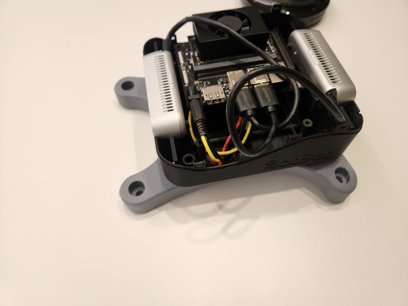

2. 移除背部安装孔的贴纸保护膜
3. 将网线和电源线连接到机器人
4. 将电缆穿过面板开口
  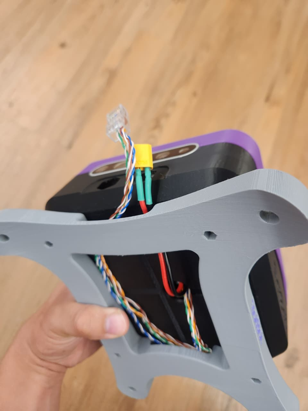

5. 将接口放置在机器人背部，对齐螺丝孔

6. 使用 M6x30 螺丝将接口固定在机器人上
  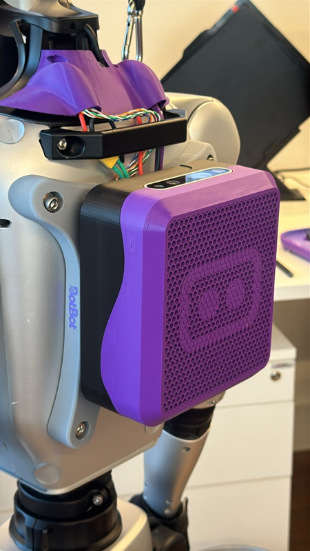

---

##### 步骤 4：连接 BotBrain

**任务：**
1. 将电源和网线连接到 BotBrain
2. 使用定位销定位 BotBrain 并拧紧螺丝

---

### Unitree Go2 接口

Unitree Go2 四足机器人的安装接口。

#### 物料清单 - Go2 接口

##### 3D 打印部件

| 部件 | 数量 | 文件 | 备注 |
|------|----------|------|-------|
| Go2 接口支架 | 1 | [Go2/go2_interface.stl](../../../hardware/Go2/go2_interface.stl) | 主安装支架 |

##### 紧固件和硬件

| 物品 | 数量 | 备注 |
|------|----------|-------|
| M3x30 | 2 | 优选内六角 |
| M3x20 | 2 | 优选内六角 |
| M3 弹簧垫圈 | 4 | - |

##### 额外组件

| 物品 | 数量 | 备注 |
|------|----------|-------|
| 网线 | 1 | - |
| XT-30 引线 | 1 | - |
|

#### 组装步骤 - Go2 接口

##### 步骤 1：打印接口

使用[打印设置](#打印设置)打印 Go2 接口支架。

---

##### 步骤 2：准备接口

**任务：**
1. 移除所有支撑材料
2. 打磨任何粗糙边缘或凸起
3. 确认所有安装点已清理干净

---

##### 步骤 3：安装到机器人

**任务：**
1. 拧下顶盖螺丝
  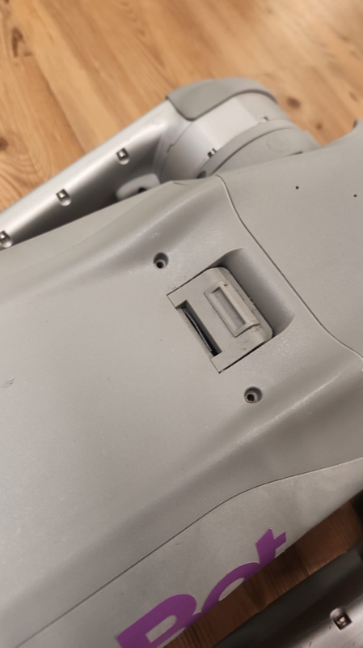

2. 将网线和电源线连接到机器人
  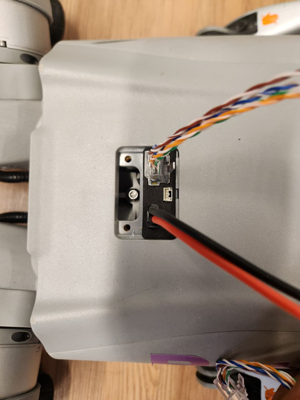

3. 将电缆穿过接口开口
  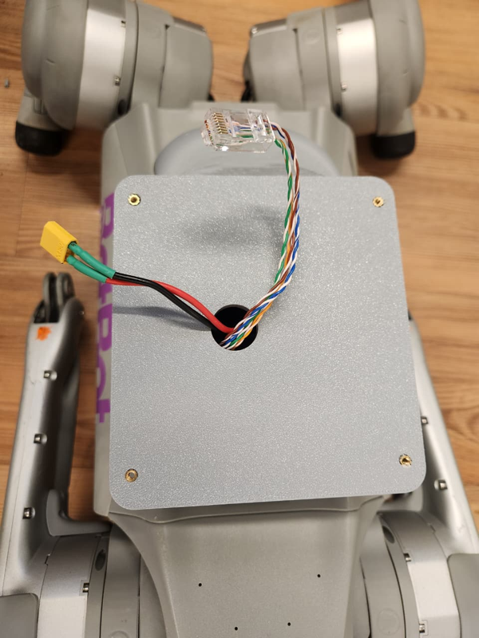

4. 将接口放置在机器人背部，用 M3x30 螺栓固定前法兰，用 M3x20 螺栓固定后法兰
  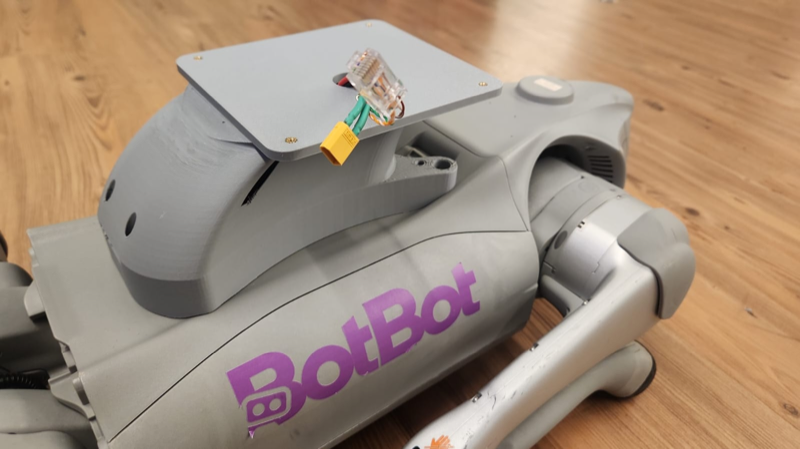

5. 用 4 颗 M3 自攻螺丝将 BotBrain 固定到接口
  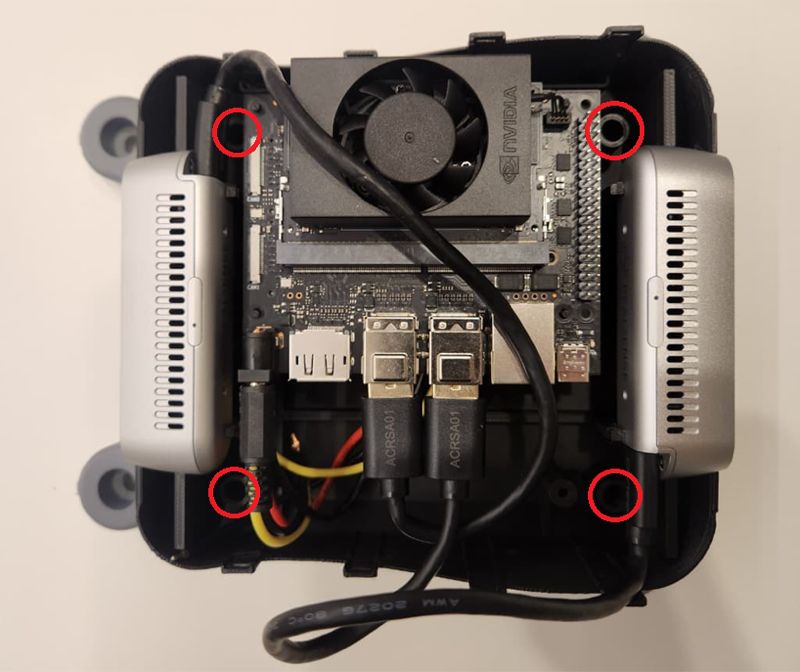

---

##### 步骤 4：连接 BotBrain

**任务：**
1. 将电源和网线连接到 BotBrain
2. 使用定位销定位 BotBrain 并拧紧螺丝

---

### Tita 接口

Legged Robotics Tita 机器人的安装接口。

#### 物料清单 - Tita 接口

##### 3D 打印部件

| 部件 | 数量 | 文件 | 备注 |
|------|----------|------|-------|
| Tita 接口支架 | 1 | [Tita/tita_interface2.stl](../../../hardware/Tita/tita_interface.stl) | 主安装支架 |

##### 紧固件和硬件

| 物品 | 数量 | 备注 |
|------|----------|-------|
| M4x35 | 1 | 优选内六角 |
| M4 平垫圈 | 1 | - |

##### 额外组件

| 物品 | 数量 | 备注 |
|------|----------|-------|
| DB25 转网线/电源线 | 1 | 定制制作 |

> ***注意**：Tita 机器人的电源和通信电缆在 Tita 侧使用 DB25 连接器。此电缆可以使用此 [Tita 电气原理图](../../tita_conn_sch.pdf) 作为参考进行制作/焊接。*

#### 组装步骤 - Tita 接口

##### 步骤 1：打印接口

使用[打印设置](#打印设置)打印 Tita 接口支架。

---

##### 步骤 2：准备接口

**任务：**
1. 移除所有支撑材料
2. 打磨粗糙边缘

---

##### 步骤 3：安装到机器人

**任务：**

1. 将接口滑到 Tita 的导轨上，直到接口螺丝孔与 Tita 的安装点对齐
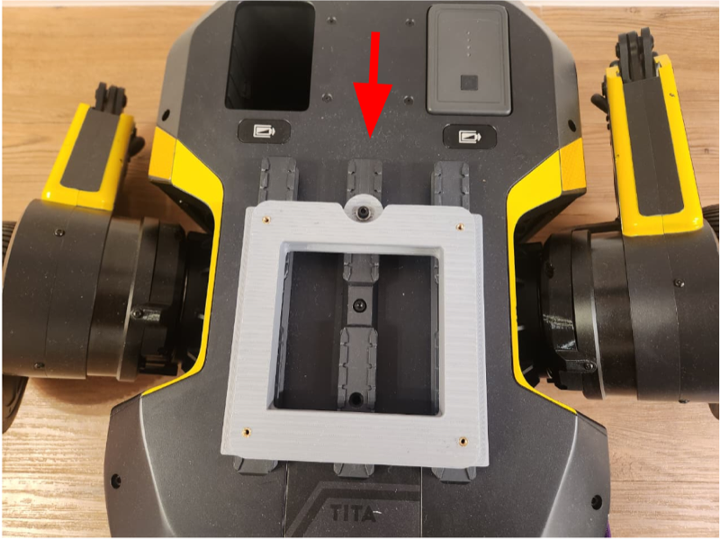

2. 将带有电源和网线连接器的电缆穿过接口前部开口
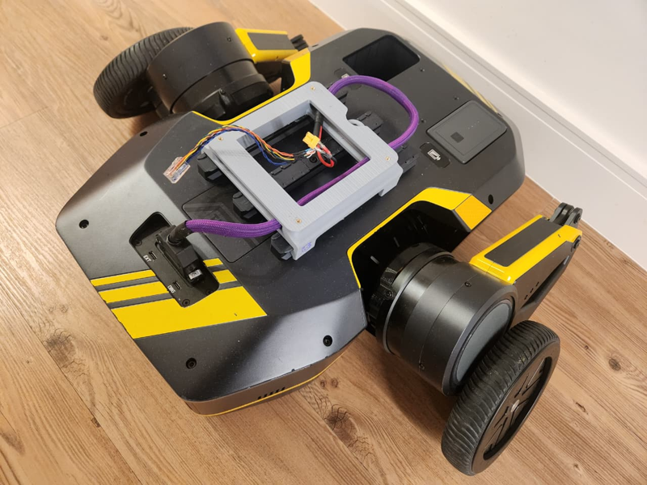

3. 将网线连接到 Botbrain 并拧紧 4 颗 M3x10 自攻螺丝以确保组件稳定性
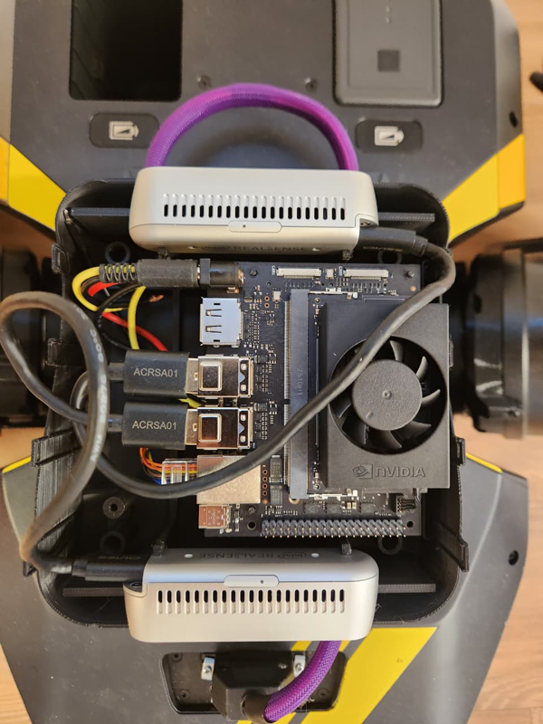

---

##### 步骤 4：连接 BotBrain

**任务：**
1. 将电源和网线连接到 BotBrain
2. 使用定位销定位 BotBrain 并固定所有螺丝

---
