# BotBrain Workspace Installation Guide

This guide walks you through each step of the BotBrain installation process, explaining what information is needed and how to obtain it.

---

## Table of Contents

1. [Welcome Screen](#1-welcome-screen)
2. [Robot Model Selection](#2-robot-model-selection)
3. [Tita Namespace Configuration](#3-tita-namespace-configuration-tita-only)
4. [Description File Type](#4-description-file-type)
5. [Robot Name Configuration](#5-robot-name-configuration)
6. [Network Interface Selection](#6-network-interface-selection)
7. [Wi-Fi Interface Selection](#7-wi-fi-interface-selection)
8. [Wi-Fi Credentials](#8-wi-fi-credentials)
9. [OpenAI API Key](#9-openai-api-key)
10. [Supabase Configuration](#10-supabase-configuration)
11. [Front Camera Selection](#11-front-camera-selection)
12. [Rear Camera Selection](#12-rear-camera-selection)
13. [Installation Confirmation](#13-installation-confirmation)
14. [Installation Progress](#14-installation-progress)

---

## 1. Welcome Screen

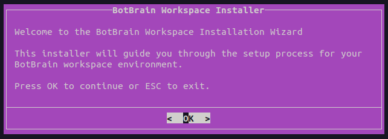

**What to do:**
- Press OK to continue or ESC to cancel the installation

---

## 2. Robot Model Selection

Select the robot model you're using for this workspace.


**How to choose:**
- Select the model that matches your physical robot
- If your robot is not listed, select "other" and you'll be prompted to enter a custom name

**If you select "other":**


Enter your custom robot model name using lowercase letters, numbers, and underscores.

---

## 3. Tita Namespace Configuration (Tita Only)

If you selected "tita" as your robot model, you'll need to configure the Tita namespace.

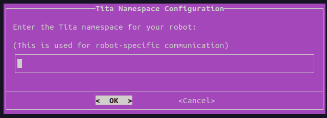

**How to obtain:**
- Check the published topics of your Tita

---

## 4. Description File Type

Select the format for your robot description file.

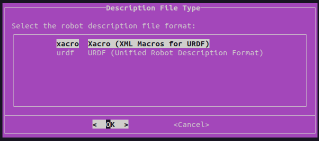

**Available options:**
- **xacro** - XML Macros for URDF (recommended for complex robots with parametric models)
- **urdf** - Unified Robot Description Format (simpler, static format)

**How to choose:**
- Check your robot's package to see which format is available
- Most modern ROS2 packages use xacro
- If unsure, select xacro as it's more flexible

---

## 5. Robot Name Configuration

Choose whether to set a custom name for your robot.

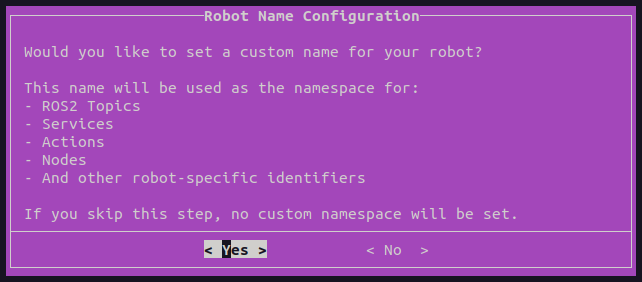

**What is the robot name:**
- A custom namespace used for all ROS2 topics, services, actions, and nodes
- Allows multiple robots of the same model to operate on the same network
- Optional - you can skip this if you're only running one robot

**When to use:**
- Running multiple robots on the same network
- Want to identify your robot uniquely in multi-robot systems
- Need separate ROS2 namespaces for organization

**If you select "Yes":**

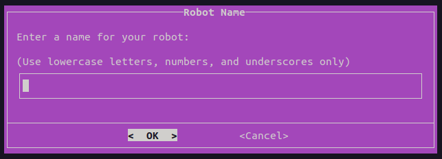

**Naming rules:**
- Use lowercase letters, numbers, and underscores only
- No spaces or special characters
- Examples: `robot_1`, `my_bot`, `warehouse_bot_a`

---

## 6. Network Interface Selection

Select the network interface that will be used for ROS2 DDS communication.

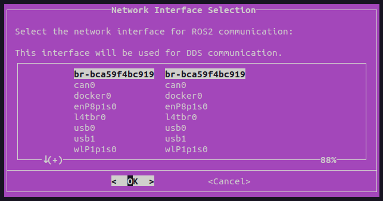

**What is this:**
- The network interface through which ROS2 will communicate, usually the phisical ethernet connection with your robot

**How to find your network interfaces:**

Open a terminal:

On **Linux**, run:
```bash
ifconfig -a
```

**Common interface names:**
- **eth0**, **enp0s3** - Ethernet/wired connection
- **wlan0**, **wlp2s0** - Wireless connection
- **lo0**, **lo** - Loopback (excluded from list)

**How to choose:**
- If connecting via Ethernet cable, select the Ethernet interface
- If using Wi-Fi, select the wireless interface
- The installer automatically detects available interfaces

**If none are detected or you need a custom interface:**

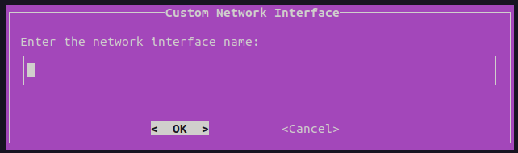

Enter the interface name manually.

---

## 7. Wi-Fi Interface Selection

Select the Wi-Fi interface for wireless connectivity.

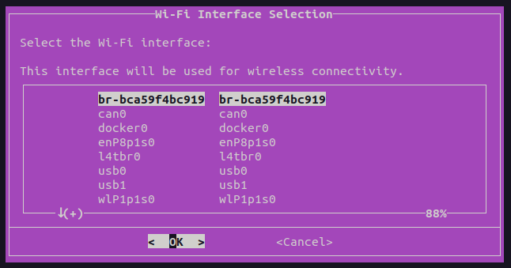

**What is this:**
- The wireless network interface on your system
- Used for Wi-Fi connections and automatic connection management

**How to find your Wi-Fi interface:**

On **Linux**, run:
```bash
iwconfig
```

**Common Wi-Fi interface names:**
- **wlan0**, **wlp2s0** - Linux wireless interface

**If you need to enter a custom interface:**

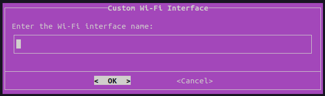

---

## 8. Wi-Fi Credentials

Enter the default Wi-Fi network credentials for automatic connection.

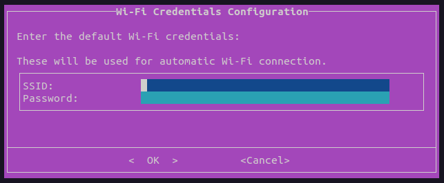

**What to enter:**
- **SSID**: The name of your Wi-Fi network
- **Password**: The password for your Wi-Fi network

**Where to find:**
- Check your router settings
- Look at your router label

**Important notes:**
- These credentials will be stored in the robot configuration file
- Used for automatic Wi-Fi connection on boot
- Make sure to enter the exact SSID (case-sensitive)

---

## 9. OpenAI API Key

Optionally configure an OpenAI API key for GPT-powered features.

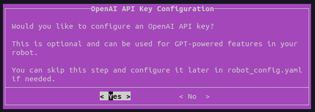

**What is this:**
- API key for accessing OpenAI's GPT models
- Optional - can be configured later if needed
- Used for AI-powered robot features

**If you select "Yes":**

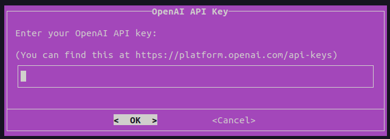

**How to obtain:**
1. Visit [https://platform.openai.com/api-keys](https://platform.openai.com/api-keys)
2. Sign in or create an OpenAI account
3. Click "Create new secret key"
4. Copy the generated key
5. Paste it in the installer

**Important:**
- You can skip this and configure it later in `robot_config.yaml`

---

## 10. Supabase Configuration

Configure Supabase credentials for the web server interface.

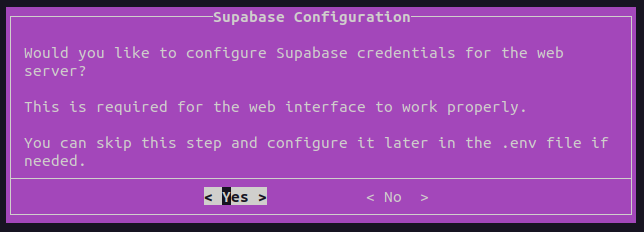

**What is this:**
- Supabase is used for the web interface backend
- Required for the web dashboard to work properly
- Can be configured later if needed

**If you select "Yes":**

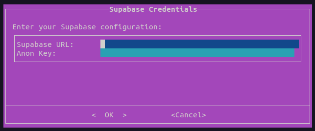

**How to obtain:**
See [Supabase Setup](SUPABASE_SETUP.md)

**What gets configured:**
- Creates a `.env` file in the root directory
- Used by `docker-compose.yaml` for the web server
- Can be edited later if needed

---

## 11. Front Camera Selection

Select the camera model for the front-facing camera.

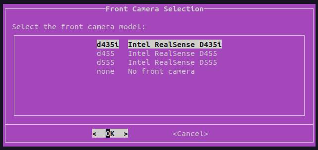

**How to choose:**
- Match the model with your physical camera
- Check the camera label or documentation
- Select "none" if you don't have a front camera

**If you select a camera model:**

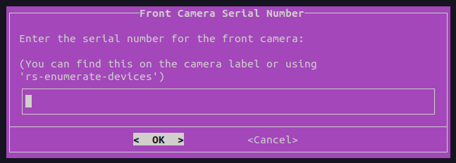

**How to find the serial number:**

1. Check the camera's physical label in it bottom part

or

2. Using the RealSense SDK:
```bash
rs-enumerate-devices
```

This will display all connected RealSense cameras with their serial numbers.

**Alternative methods:**
- Look in the camera's documentation
- Use Intel RealSense Viewer application

---

## 12. Rear Camera Selection

Select the camera model for the rear-facing camera.

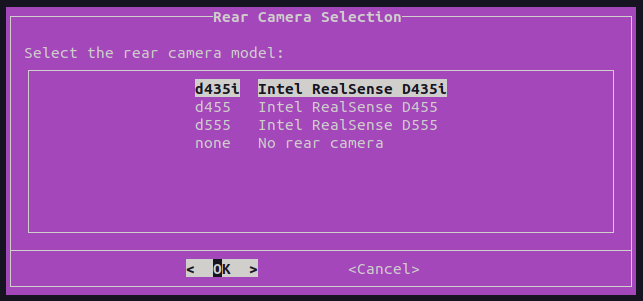

**How to choose:**
- Match the model with your physical camera
- Select "none" if you don't have a rear camera
- Can be different from the front camera model

**If you select a camera model:**

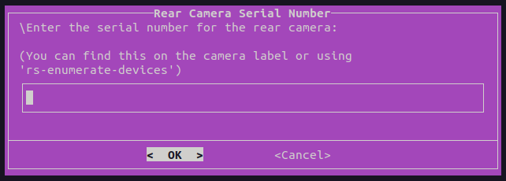

**How to find the serial number:**
- Same process as the front camera

---

## 13. Installation Confirmation

Review your configuration before proceeding with the installation.

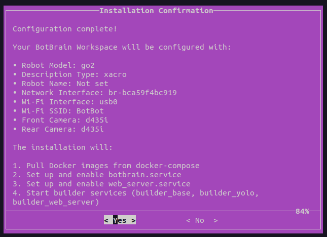

**What this shows:**
- Summary of all your configuration choices
- List of installation tasks that will be performed
- Estimated installation scope

**What happens during installation:**
1. **Pull Docker images** - Downloads required container images
2. **Setup botbrain.service** - Configures and enables the main robot service
3. **Setup web_server.service** - Configures and enables the web interface service
4. **Start builder services** - Launches the builder_base and builder_yolo containers

**Important notes:**
- This process may take several minutes depending on your internet connection
- Docker images can be several GB in size
- Make sure you have sufficient disk space
- The process cannot be paused once started

**If you need to make changes:**
- Select "No" to cancel
- Run the installer again with the correct configuration

---

## 14. Installation Progress

Track the installation progress as each task completes.

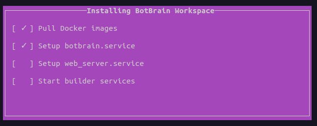

**Progress indicators:**
- **✓** - Task completed successfully
- **●** or **...** - Task currently in progress
- **Blank** - Task not yet started


**Upon completion:**

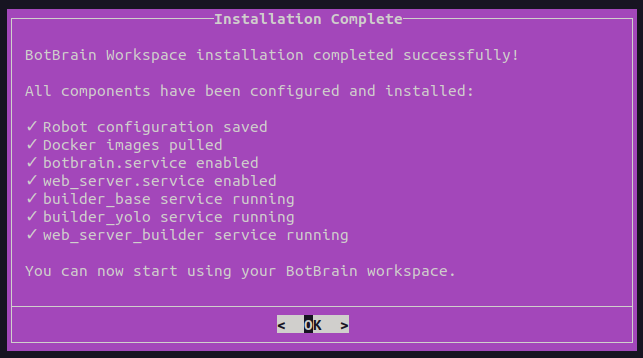

**What happens next:**
- All configuration files are updated
- Services are enabled and ready to start
- Builder containers are running
- You can now use your BotBrain workspace

**Post-installation:**
- Services will start automatically on boot
- You can manually start services with:
  ```bash
  sudo systemctl start botbrain.service
  sudo systemctl start web_server.service
  ```
- Check service status with:
  ```bash
  sudo systemctl status botbrain.service
  sudo systemctl status web_server.service
  ```

---

## Summary

This installation guide covers all the steps needed to configure and install your BotBrain workspace.

Make sure to fill in all required information accurately to ensure a successful installation.
